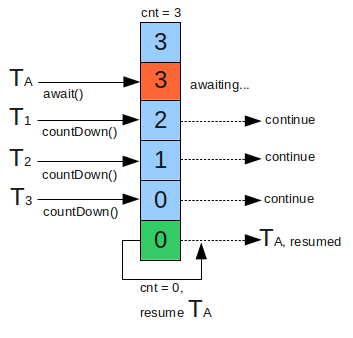

# Java concurrency – CountDownLatch Example


参考网址：http://howtodoinjava.com/core-java/multi-threading/when-to-use-countdownlatch-java-concurrency-example-tutorial/


As per java docs, CountDownLatch is a synchronization aid that allows one or more threads to wait until a set of operations being performed in other threads completes. CountDownLatch concept is very common interview question in java concurrency, so make sure you understand it well. In this post, I will cover following points related to CountDownLatch in java concurrency.

```Sections in this post:

What is CountDownLatch?
How CountDownLatch works?
Possible usages in real time applications
Example application
Common interview questions```

###What is CountDownLatch?

CountDownLatch was introduced with JDK 1.5 along with other concurrent utilities like CyclicBarrier, Semaphore, ConcurrentHashMap and BlockingQueue in java.util.concurrent package. This class enables a java thread to wait until other set of threads completes their tasks. e.g. Application’s main thread want to wait, till other service threads which are responsible for starting framework services have completed started all services.

CountDownLatch works by having a counter initialized with number of threads, which is decremented each time a thread complete its execution. When count reaches to zero, it means all threads have completed their execution, and thread waiting on latch resume the execution.



Pseudo code for CountDownLatch can be written like this:

//Main thread start<br>
//Create CountDownLatch for N threads<br/>
//Create and start N threads<br/>
//Main thread wait on latch<br/>
//N threads completes there tasks are returns<br/>
//Main thread resume execution<br/>

............其余内容参考网址