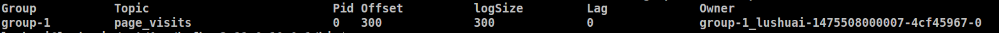

# kafka常用命令

####查看kafka offset


```/opt/App/kafka_2.11-0.10.0.1/bin$ sh kafka-consumer-offset-checker.sh --zookeeper lushuai:2181 --group group-1 --topic page_visits```



####查询topic的offset的范围
用下面命令可以查询到topic:page_visits broker:localhost:9092的offset的最小值：

```/bin/kafka-run-class.sh kafka.tools.GetOffsetShell --broker-list localhost:9092 —topic page_visits --time -2
输出： DynamicRange:0:10


从上面的输出可以看出topic:DynamicRange只有一个partition:0 offset范围为:[10,128]

查询offset的最大值：
bin/kafka-run-class.sh kafka.tools.GetOffsetShell --broker-list localhost:9092 —topic page_visits --time -1
输出：DynamicRange:0:128```

####重置kafka的 offset
如果你在使用Kafka来分发消息，在数据处理的过程中可能会出现处理程序出异常或者是其它的错误，会造成数据丢失或不一致。这个时候你也许会想要通过kafka把数据从新处理一遍，我们知道kafka默认会在磁盘上保存到7天的数据，你只需要把kafka的某个topic的consumer的offset设置为某个值或者是最小值，就可以使该consumer从你设置的那个点开始消费。

启动zookeeper client

$ /opt/cloudera/parcels/CDH/lib/zookeeper/bin/zkCli.sh
通过下面命令设置consumer group:DynamicRangeGroup topic:localhost partition:10的offset为128:

set /consumers/group-1/offsets/page_visits/0 128
注意如果你的kafka设置了zookeeper root，比如为/kafka，那么命令应该改为：

set /consumers/group-1/offsets/page_visits/0 1288