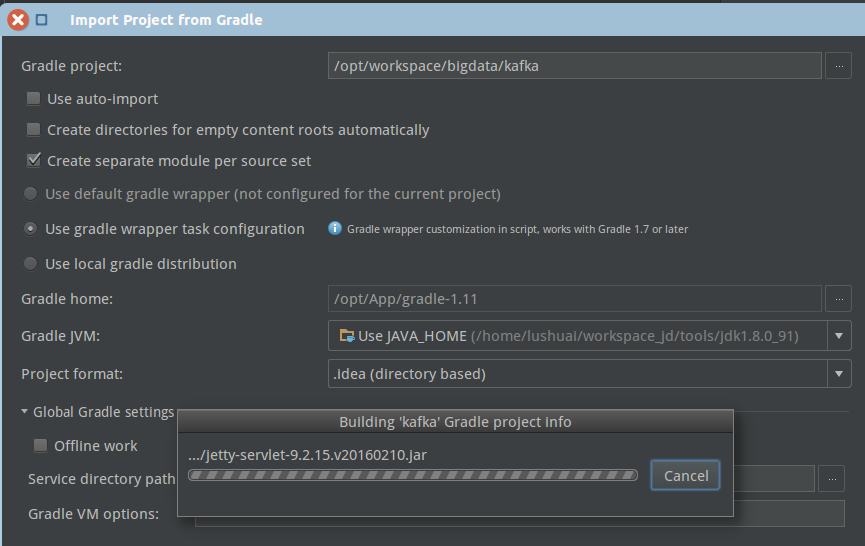

[](https://www.jetbrains.com/help/idea/2016.2/gradle.html)# kafka基础备注


### 1. kafka源码导入idea环境


   file->open->选择build.gradle
   
   gradle使用参考https://www.jetbrains.com/help/idea/2016.2/gradle.html
   
   ###2. kafka源码demo解析
   
参考[使用Kafka Stream处理数据](http://www.orchome.com/300) 示例介绍了WordCountDemo的读取topic的数据并发计算结果写出到另一个topic中。
源码一（高级API）：
```/**
 * Demonstrates, using the high-level KStream DSL, how to implement the WordCount program
 * that computes a simple word occurrence histogram from an input text.
 *
 * In this example, the input stream reads from a topic named "streams-file-input", where the values of messages
 * represent lines of text; and the histogram output is written to topic "streams-wordcount-output" where each record
 * is an updated count of a single word.
 *
 * Before running this example you must create the source topic (e.g. via bin/kafka-topics.sh --create ...)
 * and write some data to it (e.g. via bin-kafka-console-producer.sh). Otherwise you won't see any data arriving in the output topic.
 */
public class WordCountDemo {

    public static void main(String[] args) throws Exception {
        Properties props = new Properties();
        props.put(StreamsConfig.APPLICATION_ID_CONFIG, "streams-wordcount");
        props.put(StreamsConfig.BOOTSTRAP_SERVERS_CONFIG, "localhost:9092");
        props.put(StreamsConfig.ZOOKEEPER_CONNECT_CONFIG, "localhost:2181");
        props.put(StreamsConfig.KEY_SERDE_CLASS_CONFIG, Serdes.String().getClass().getName());
        props.put(StreamsConfig.VALUE_SERDE_CLASS_CONFIG, Serdes.String().getClass().getName());

        // setting offset reset to earliest so that we can re-run the demo code with the same pre-loaded data
        props.put(ConsumerConfig.AUTO_OFFSET_RESET_CONFIG, "earliest");

        KStreamBuilder builder = new KStreamBuilder();

        KStream<String, String> source = builder.stream("streams-file-input");

        KTable<String, Long> counts = source
                .flatMapValues(new ValueMapper<String, Iterable<String>>() {
                    @Override
                    public Iterable<String> apply(String value) {
                        return Arrays.asList(value.toLowerCase(Locale.getDefault()).split(" "));
                    }
                }).map(new KeyValueMapper<String, String, KeyValue<String, String>>() {
                    @Override
                    public KeyValue<String, String> apply(String key, String value) {
                        return new KeyValue<>(value, value);
                    }
                })
                .groupByKey()
                .count("Counts");

        // need to override value serde to Long type
        counts.to(Serdes.String(), Serdes.Long(), "streams-wordcount-output");

        KafkaStreams streams = new KafkaStreams(builder, props);
        streams.start();

        // usually the stream application would be running forever,
        // in this example we just let it run for some time and stop since the input data is finite.
        Thread.sleep(5000L);

        streams.close();
    }
}
```

源码二（低级API）：
```/**
 * Demonstrates, using the low-level Processor APIs, how to implement the WordCount program
 * that computes a simple word occurrence histogram from an input text.
 *
 * In this example, the input stream reads from a topic named "streams-file-input", where the values of messages
 * represent lines of text; and the histogram output is written to topic "streams-wordcount-processor-output" where each record
 * is an updated count of a single word.
 *
 * Before running this example you must create the source topic (e.g. via bin/kafka-topics.sh --create ...)
 * and write some data to it (e.g. via bin-kafka-console-producer.sh). Otherwise you won't see any data arriving in the output topic.
 */
public class WordCountProcessorDemo {

    private static class MyProcessorSupplier implements ProcessorSupplier<String, String> {

        @Override
        public Processor<String, String> get() {
            return new Processor<String, String>() {
                private ProcessorContext context;
                private KeyValueStore<String, Integer> kvStore;

                @Override
                @SuppressWarnings("unchecked")
                public void init(ProcessorContext context) {
                    this.context = context;
                    this.context.schedule(1000);
                    this.kvStore = (KeyValueStore<String, Integer>) context.getStateStore("Counts");
                }

                @Override
                public void process(String dummy, String line) {
                    String[] words = line.toLowerCase(Locale.getDefault()).split(" ");

                    for (String word : words) {
                        Integer oldValue = this.kvStore.get(word);

                        if (oldValue == null) {
                            this.kvStore.put(word, 1);
                        } else {
                            this.kvStore.put(word, oldValue + 1);
                        }
                    }

                    context.commit();
                }

                @Override
                public void punctuate(long timestamp) {
                    try (KeyValueIterator<String, Integer> iter = this.kvStore.all()) {
                        System.out.println("----------- " + timestamp + " ----------- ");

                        while (iter.hasNext()) {
                            KeyValue<String, Integer> entry = iter.next();

                            System.out.println("[" + entry.key + ", " + entry.value + "]");

                            context.forward(entry.key, entry.value.toString());
                        }
                    }
                }

                @Override
                public void close() {
                    this.kvStore.close();
                }
            };
        }
    }

    public static void main(String[] args) throws Exception {
        Properties props = new Properties();
        props.put(StreamsConfig.APPLICATION_ID_CONFIG, "streams-wordcount-processor");
        props.put(StreamsConfig.BOOTSTRAP_SERVERS_CONFIG, "localhost:9092");
        props.put(StreamsConfig.ZOOKEEPER_CONNECT_CONFIG, "localhost:2181");
        props.put(StreamsConfig.KEY_SERDE_CLASS_CONFIG, Serdes.String().getClass());
        props.put(StreamsConfig.VALUE_SERDE_CLASS_CONFIG, Serdes.String().getClass());

        // setting offset reset to earliest so that we can re-run the demo code with the same pre-loaded data
        props.put(ConsumerConfig.AUTO_OFFSET_RESET_CONFIG, "earliest");

        TopologyBuilder builder = new TopologyBuilder();

        builder.addSource("Source", "streams-file-input");

        builder.addProcessor("Process", new MyProcessorSupplier(), "Source");
        builder.addStateStore(Stores.create("Counts").withStringKeys().withIntegerValues().inMemory().build(), "Process");

        builder.addSink("Sink", "streams-wordcount-processor-output", "Process");

        KafkaStreams streams = new KafkaStreams(builder, props);
        streams.start();

        // usually the stream application would be running forever,
        // in this example we just let it run for some time and stop since the input data is finite.
        Thread.sleep(5000L);

        streams.close();
    }
}
```